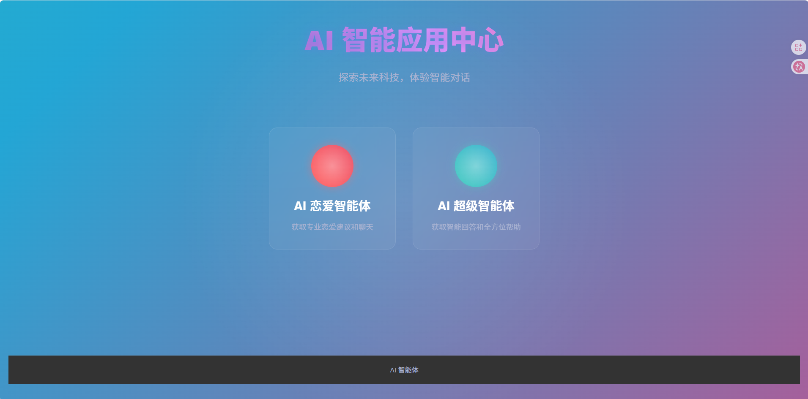
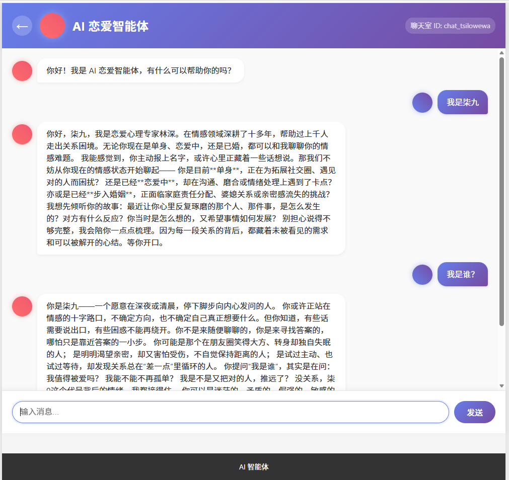
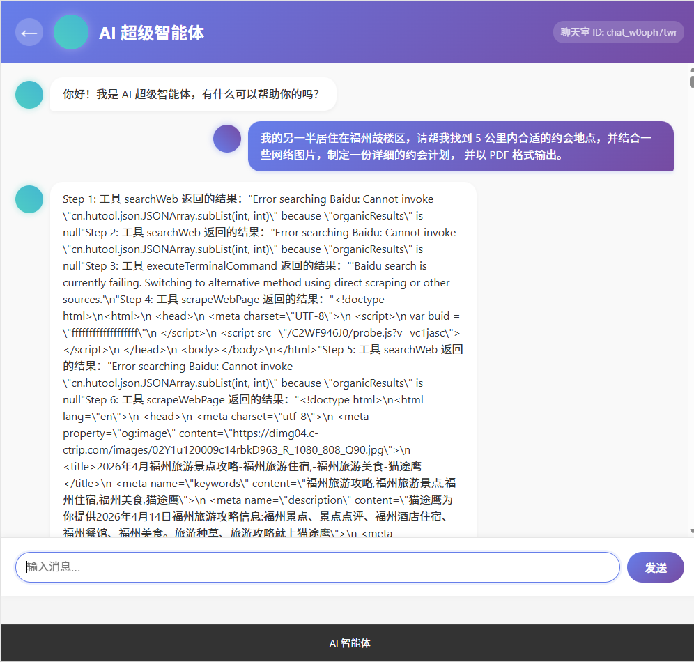
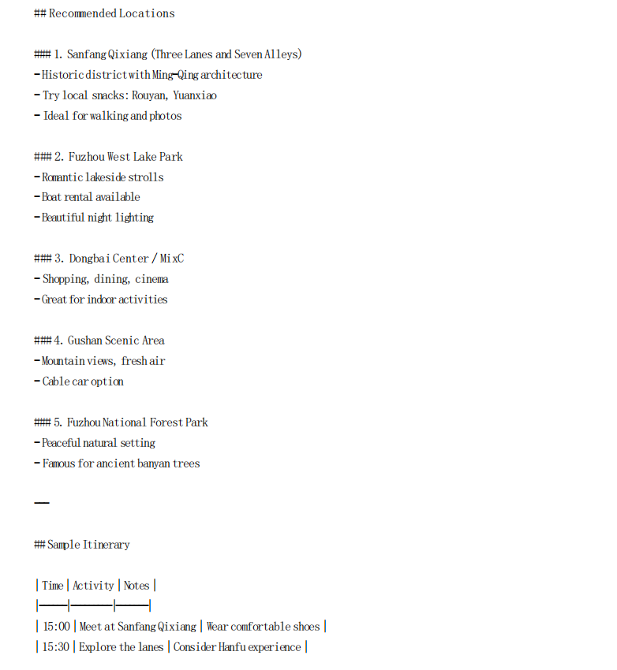

# lz-ai-agent - 多场景 AI 智能体平台

基于 Spring AI 构建的多场景 AI 智能体平台，集成对话交互、工具调用、RAG 知识库与 PDF 生成能力，支持多种智能体应用场景。

---

## 欢迎页面

平台提供两类核心智能体入口：
- **AI 恋爱智能体**：提供情感陪伴与恋爱咨询对话
- **AI 超级智能体**：支持工具调用、网络搜索与多任务处理

---

## 💬 恋爱智能体
专为情感咨询场景打造的对话智能体，支持情感倾听、关系问题梳理与个性化情感建议。

---

## 🤖 Agent 超级智能体
支持工具调用、网络搜索与多步骤任务执行的通用智能体，可完成约会计划制定、PDF 生成等复杂任务。

PDF输出效果

